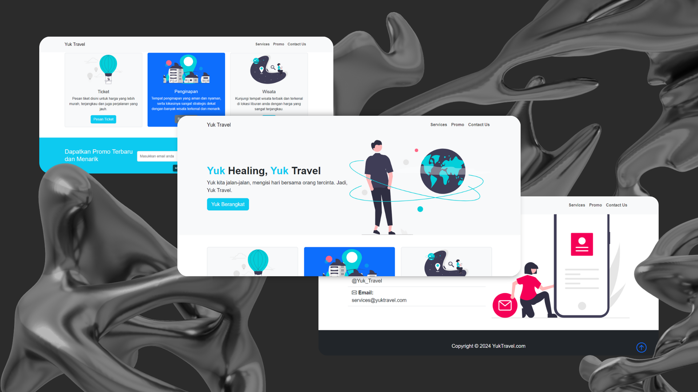

# ✈️ YukTravel-Bootstrap

**YukTravel-Bootstrap** is a responsive landing page for a travel service built using **HTML**, **CSS**, and **Bootstrap 5**. This project is designed with a modern, clean, and user-friendly interface to help users explore destinations and book travel packages online with ease.

---

## 🔍 Key Features

- 🌐 **Responsive** design for mobile, tablet, and desktop
- 🎨 **Modern layout** with attractive visuals
- 📋 **Complete information** about destinations, travel packages, and contact
- 🔗 **Easy navigation** and smooth scrolling
- 💡 Built with well-structured HTML and Bootstrap 5 components

---

## 🛠️ Technologies Used


---

## 📸 Preview Screenshot



---

## 🚀 Getting Started

1. Clone this repository to your local machine:
   ```bash
   git clone https://github.com/Fabianugerah/YukTravel-Bootstrap.git
